# AI智能客服售前跟进系统 UML图（正式工程版）

版本：v0.7

日期：2026-07-20

最近修订：2026-07-20，按技术方案 v0.8 和 Worker V16.98 调整 C2：首屏事实扫描与 read-target 授权分离；只准入有效短码 private 单聊；群聊/unknown 终止；消息使用 V3 合同和 authorization_revision；语音在同一读取 flow 内条件性转写；图片识别待定。

口径：正式工程完整合并版。取消 AI 固定轮次限制，采用长期跟进状态机；备注短码作为系统托管开关；销售未绑定Worker时，add_friend任务进入blocked并在后续绑定Worker后恢复pending；统一任务中心采用 `task.status + task.result_code`。C2 是 Worker 运行时事实采集和消息入库能力，不进入统一任务中心；短码只是候选入口，读取还必须满足 private、当前 read-target 和 authorization_revision。图片 Vision 尚未进入本版架构。

独立图文件：
- 主业务时序图：`AI智能客服售前跟进系统_主业务时序图_C0-C4_v0.7.puml`
- 会话状态机图：`AI智能客服售前跟进系统_会话状态机图_v0.6.puml`

说明：状态机以本文档和 PUML 源文件为准。PNG 仅作为本地临时预览图，不作为当前有效文档或开发验收依据。

## 1. 职责边界组件图

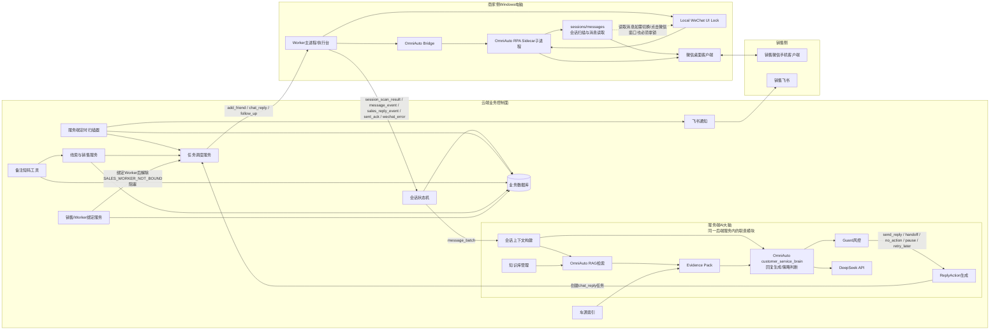

## 2. Worker与服务端扫描/定向读取分工图

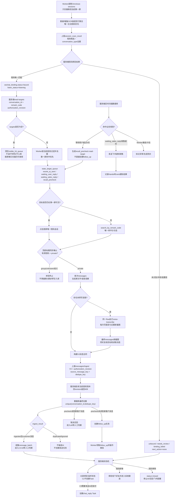

## 2.1 微信UI操作串行锁

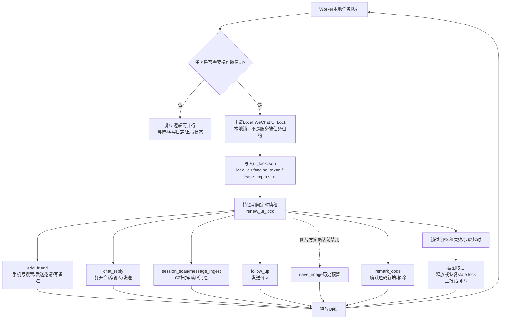

## 3. 主业务时序图（线索进入到结束，按C0/C1/C2/C3/C4分段）

说明：本图采用 PlantUML/PUML 维护，源文件为 `AI智能客服售前跟进系统_主业务时序图_C0-C4_v0.7.puml`。C2 是 Worker 运行时事实采集和消息入库能力，不进入统一任务中心。

```plantuml
@startuml
title AI智能客服售前跟进系统 主业务时序图 C0-C4

skinparam monochrome true
skinparam shadowing false
skinparam sequence {
  ArrowColor #222222
  LifeLineBorderColor #999999
  LifeLineBackgroundColor #FFFFFF
  ParticipantBorderColor #222222
  ParticipantBackgroundColor #FFFFFF
  BoxBorderColor #777777
  BoxBackgroundColor #FFFFFF
  GroupBorderColor #777777
  GroupBackgroundColor #FFFFFF
}

autonumber

participant "线索来源/人工导入" as L
participant "线索与销售服务" as LS
participant "销售/Worker绑定" as BS
participant "统一任务中心" as TS
participant "Worker主进程" as W
participant "OmniAuto RPA Sidecar" as OA
participant "销售微信桌面客户端" as WX
participant "会话状态机" as CP
participant "服务端AI大脑\nOmniAuto AI Engine/DeepSeek/Guard" as AI
participant "服务端定时扫描器" as Scan
participant "飞书机器人" as FS
participant "销售手机微信" as S
participant "客户微信" as C

group C0 线索入库、分配、生成加好友任务
  L -> LS: 手机号线索进入系统
  LS -> LS: 去重、脱敏、创建 lead/conversation
  LS -> BS: 查询销售与 Worker 绑定关系
  alt 销售已绑定 Worker
    LS -> TS: 创建 add_friend 任务\nstatus=pending
  else 销售未绑定 Worker
    LS -> TS: 创建 add_friend 任务\nstatus=blocked\nblock_code=SALES_WORKER_NOT_BOUND
    BS --> TS: 后续绑定 Worker 后解除阻塞
    TS -> TS: blocked -> pending
  end
end

group C1 add_friend：搜索手机号、申请好友、写客户短码
  W -> TS: 拉取/领取 add_friend 任务
  W -> OA: 调用 add-friend-entry-click-plan-windows\nphone_or_wechat / verify_message / remark_code
  OA -> WX: 手机号搜索、提交好友申请、写入客户短码
  alt 邀请发送成功
    OA --> W: completed + result_code=invite_sent
    W -> TS: 上报 task 完成
    TS -> CP: conversation.status=add_friend_sent
  else 已经是好友
    OA --> W: completed + result_code=already_friend
    W -> TS: 上报 task 完成
    TS -> CP: conversation.status=friend_added
  else 加好友失败/风控
    OA --> W: failed + error_code
    W -> TS: 上报失败和证据
    TS -> CP: 保持当前状态或转人工待处理
  end
end

group C2 V16.98：首屏扫描、授权准入、文字/语音入库；不进入任务中心
  loop Worker 运行中
    W -> OA: sessions 扫描微信当前第一屏
    OA -> WX: 普通/增强OCR按视觉行聚合\n识别短码和群聊人数证据
    OA --> W: remark_code_candidates / conversation_type evidence
    W -> CP: 上报 session_scan_result
    alt 短码唯一绑定
      CP -> CP: wechat_binding.status=bound\nlisten_status=listening
    else 未识别/短码冲突/绑定冲突
      CP -> CP: bind_status=unbound/needs_review/binding_failed
      CP --> W: next_action=none
    end

    W -> CP: 拉取 read-targets
    CP --> W: conversation_id + remark_code + authorization_revision
    alt read-targets为空
      W -> W: 清空visible_hit_queue\n不读/不转写/不入库
    else 当前授权目标
      W -> OA: 首屏唯一命中则visible\n未命中才search_by_remark_code
      OA -> WX: 点击目标并读取顶部标题
      OA --> W: remark_code + conversation_type
      alt group / unknown / 歧义
        W -> W: 本轮终止\n不再搜索/读取/转写/入库
      else 有效短码 + private
        W -> OA: 首次messages读取当前屏
        OA --> W: V3 observations
        alt 发现未转写语音
          W -> OA: 同一flow执行voice-transcribe
          OA -> WX: 逐条调用微信自带转文字\n页面变化后重新截图
          W -> OA: 最终messages新截图\n同时复核目标和读取消息
          OA --> W: 文字 + 已绑定父语音的转写结果
        end
        W -> CP: messages/ingest\ncontract_version=3 + authorization_revision\nsource_message_key + dedupe_key
        CP -> CP: 复核授权版本\nunique(conversation_id,dedupe_key)去重
        CP -> CP: 新customer消息才进入C3判断\nnext_action=none
      end
    end
  end
end

group C3 AI文字回复：服务端生成 reply_action，Worker 只执行已批准发送
  C -> WX: 客户通过好友并发送消息
  W -> CP: C2链路上报 message_event
  CP -> CP: 判断状态、风控、黑名单、静默、是否已接管
  alt 允许 AI 继续接待
    CP -> AI: 生成候选回复/evidence_pack/Guard
    AI --> CP: send_reply / handoff / no_action
    alt Guard 通过且可自动回复
      CP -> TS: 创建 chat_reply 任务和 reply_action
      W -> TS: claim reply_action
      W -> OA: pre_send_refresh 定向读取目标会话
      OA -> WX: 第一屏可见快速读取；否则搜索框粘贴remark_code并二次确认
      W -> CP: 上报 refresh message_event 或无新增
      alt 没有新客户消息
        W -> OA: send 已批准回复
        OA -> WX: 打开会话、输入、发送
        OA --> W: sent_ack
        W -> CP: 上报 sent_ack
        CP -> CP: status=waiting_user_reply
last_outbound_at=now
      else 有新客户消息
        CP -> CP: reply_action=superseded
不发送旧回复
        CP -> AI: 新message_batch重新生成回复
      end
    else 高意向/高风险/模型失败/低置信
      CP -> CP: status=waiting_sales_reply
ai_enabled=false
      CP -> FS: 飞书通知销售接管
      FS -> S: 销售收到通知
    end
  else 不允许 AI 回复
    CP -> CP: 保持等待/转人工/关闭/拒绝状态
  end
end

group C4 召回与人工跟进：召回前先precheck，Worker只执行已批准任务
  loop 服务端定时扫描
    Scan -> CP: 检查 waiting_user_reply / recalled_waiting_user / sales_replied_waiting_user
    alt 客户 N 天未回复且未拒绝/未关闭/未黑名单
      Scan -> CP: status=recall_precheck
生成 recall_precheck read-target
      W -> CP: 拉取 recall_precheck read-target
      W -> OA: messages 定向读取该会话
      OA -> WX: 读取最新消息
      W -> CP: 上报 precheck message_event 或无新增
      alt precheck读到新客户消息
        CP -> CP: 取消召回
进入AI回复/转人工判断
      else precheck确认无新客户消息
        CP -> TS: 创建 follow_up 任务
        W -> TS: 领取 follow_up
        W -> OA: 发送固定召回文案
        OA -> WX: 发送召回
        W -> CP: 上报 follow_up sent_ack
        CP -> CP: status=recalled_waiting_user
recall_count+1
      else precheck失败/目标不确认
        CP -> CP: 不发送召回
记录RECALL_PRECHECK_FAILED
      end
    else waiting_sales_reply 销售超时未回复
      Scan -> FS: 飞书提醒销售
      FS -> S: 销售收到超时提醒
    else 未命中规则
      Scan -> CP: 不生成任务
    end
  end

  alt 客户再次回复
    C -> WX: 客户回复
    W -> CP: C2链路上报 message_event
    CP -> CP: 回到 AI 判断或销售处理
  else 销售手机端人工回复
    S -> C: 销售在手机微信回复客户
    WX --> W: 桌面端同步我方消息
    W -> CP: 上报 sales_reply_event
    CP -> CP: status=sales_replied_waiting_user
AI停止
  else 客户明确拒绝
    C -> WX: 明确拒绝/拉黑/不需要
    W -> CP: 上报拒绝消息事实
    CP -> CP: status=rejected
停止加好友、AI、召回
  else 销售移除客户短码或人工关闭
    S -> WX: 修改备注移除短码/线下成交后关闭
    W -> CP: 上报 remark_code_removed
    CP -> CP: status=closed
停止系统托管
  end
end

@enduml
```

## 3.1 销售未绑定Worker时加好友任务阻塞/恢复时序图

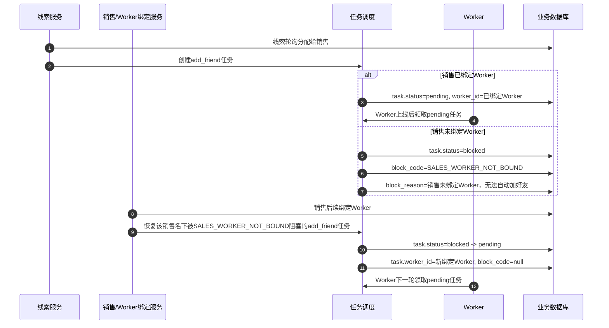

## 3.2 统一任务中心状态映射图

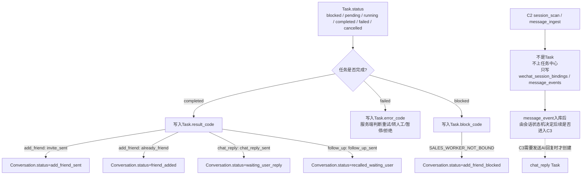

## 4. 等待用户回复与多轮召回时序图

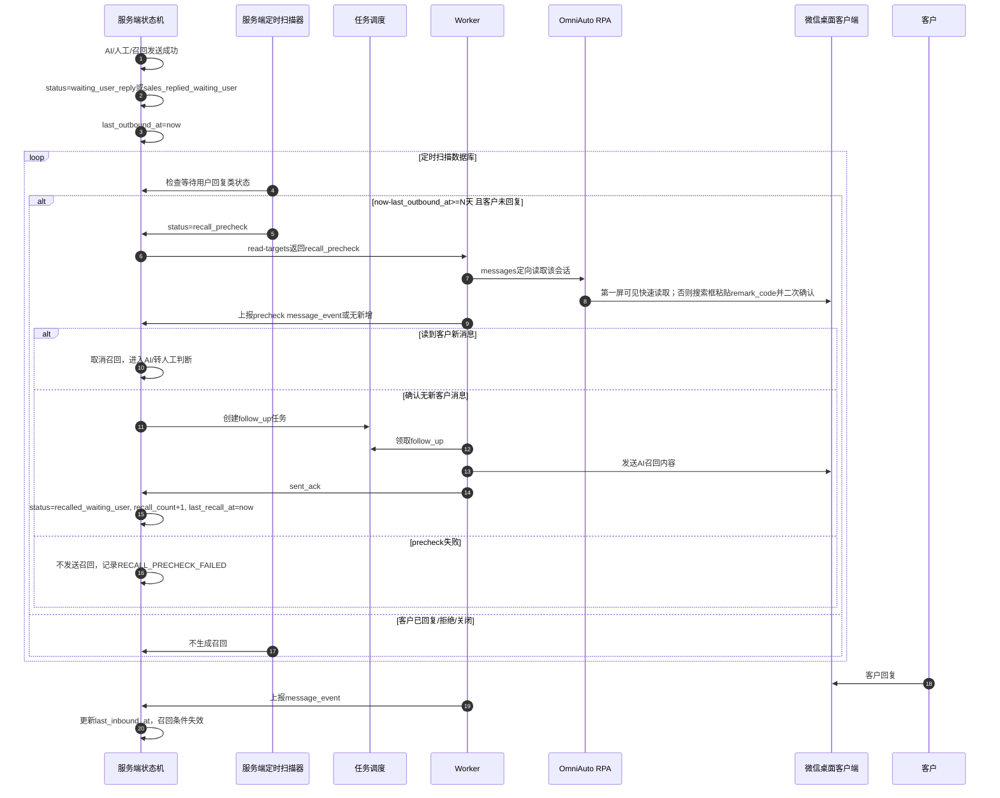

## 5. 转人工后销售超时提醒时序图

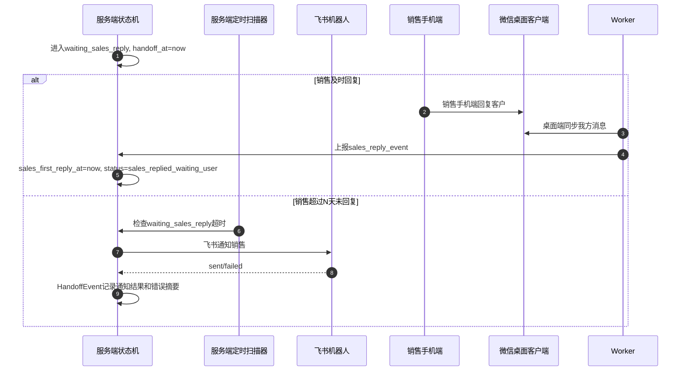

## 6. 会话状态机图（客户可视简化版）

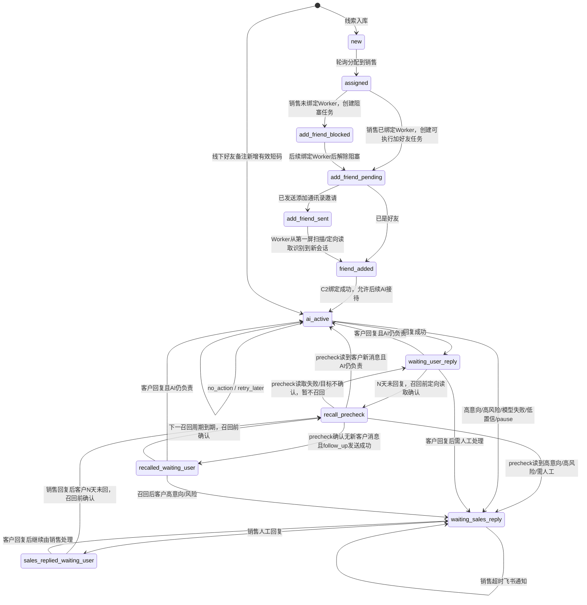

说明：`recall_precheck` 是召回前确认状态，不代表已经发送召回。只有定向读取确认没有新客户消息后，才允许创建并发送 `follow_up`。

## 6.1 全局退出规则

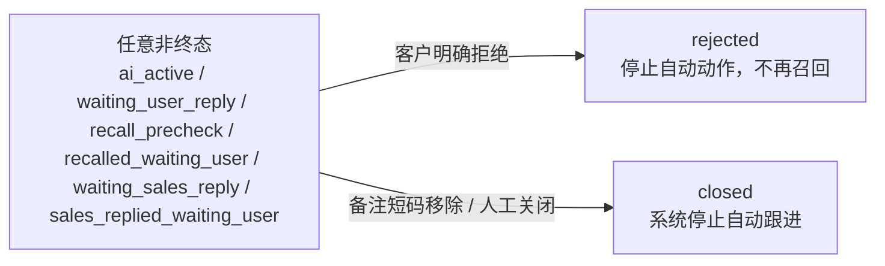

## 6.2 C2绑定与监听状态图

说明：`wechat_binding.status` 和 `conversation.listen_status` 是 C2 运行态，不混入 `conversation.status`。`conversation.status` 只表达客户/会话业务生命周期。

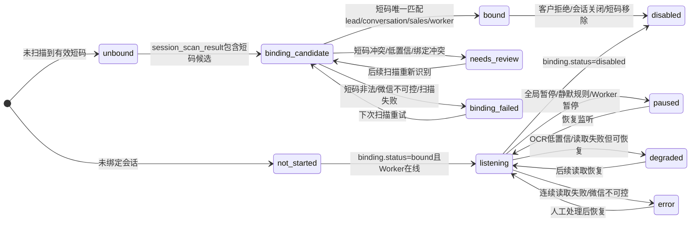

## 6.3 状态含义速查

| 状态 | 客户能理解的含义 |
|---|---|
| `assigned` | 线索已分配给销售；若销售未绑定Worker，自动加好友任务会阻塞等待绑定。 |
| `add_friend_blocked` | 加好友任务已创建但不可执行，原因是销售未绑定Worker；绑定Worker后自动恢复为待执行。 |
| `add_friend_pending` | 加好友任务可执行，等待Worker领取或Worker上线执行。 |
| `add_friend_sent` | 已发送添加通讯录邀请；不代表客户已同意或好友已添加成功。 |
| `friend_added` | Worker从会话列表识别到新会话，或发现已是好友后完成会话绑定。 |
| `ai_active` | AI正在负责接待，客户来消息后AI可继续回复。 |
| `waiting_user_reply` | AI已回复，正在等客户回。 |
| `recall_precheck` | 召回前确认读取中；还没有发送召回。 |
| `recalled_waiting_user` | 系统已做过召回，继续等客户回；到下一周期可再次召回。 |
| `waiting_sales_reply` | 已转销售，正在等销售回复客户。 |
| `sales_replied_waiting_user` | 销售已回复，正在等客户回。 |
| `rejected` | 客户明确拒绝，停止自动动作。 |
| `closed` | 销售移除短码或人工关闭，系统停止自动跟进。 |

## 7. 核心数据类图

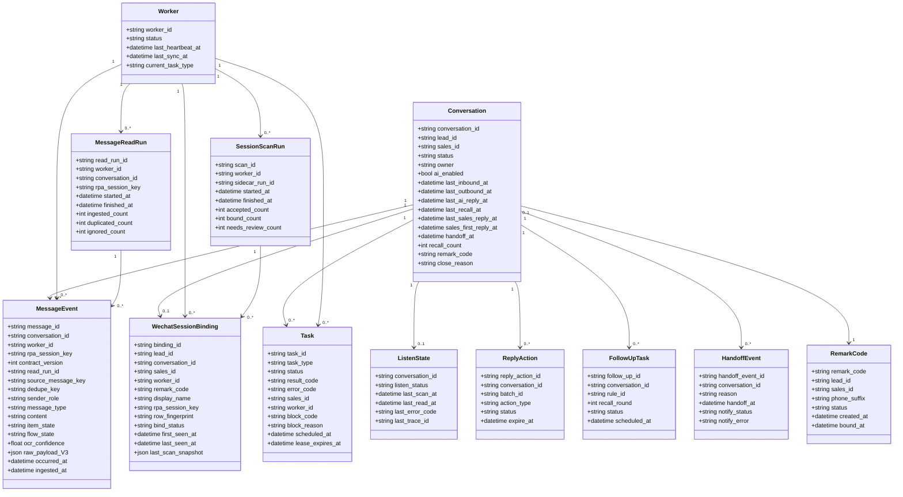

## 8. 幂等约束图

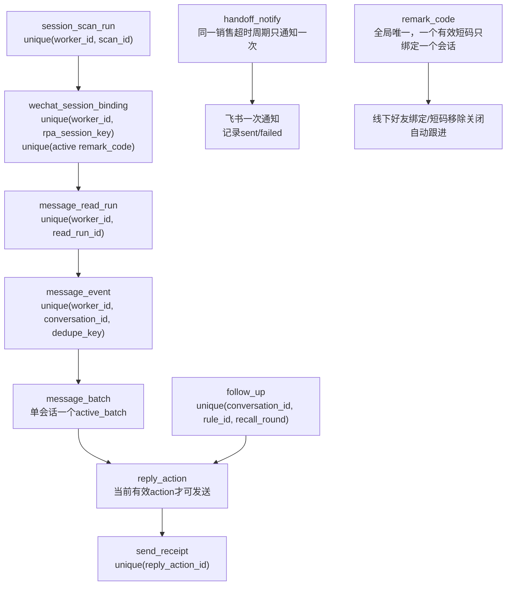
