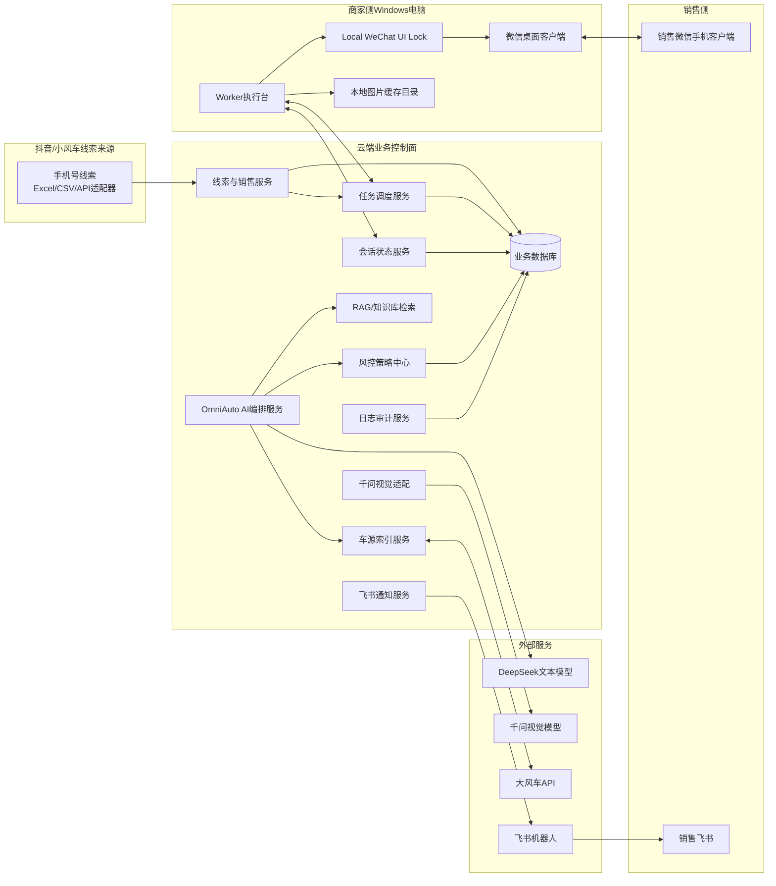
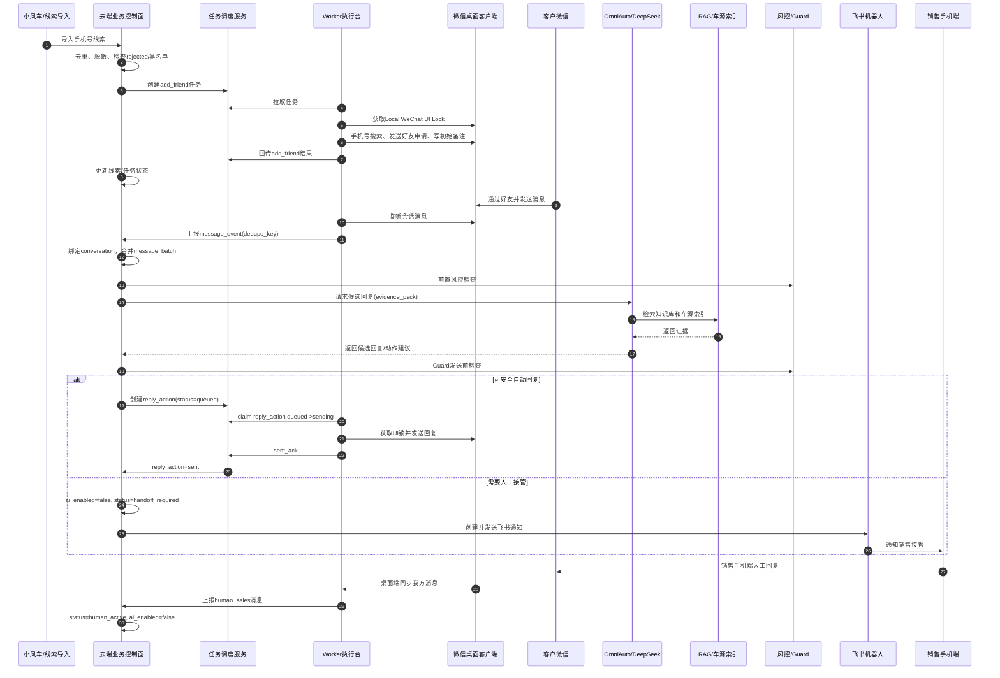
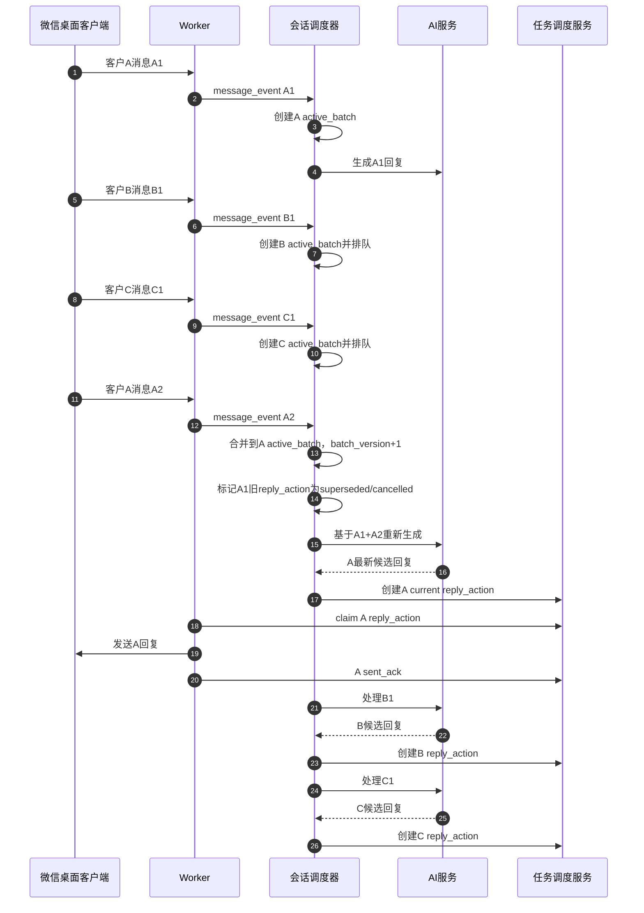
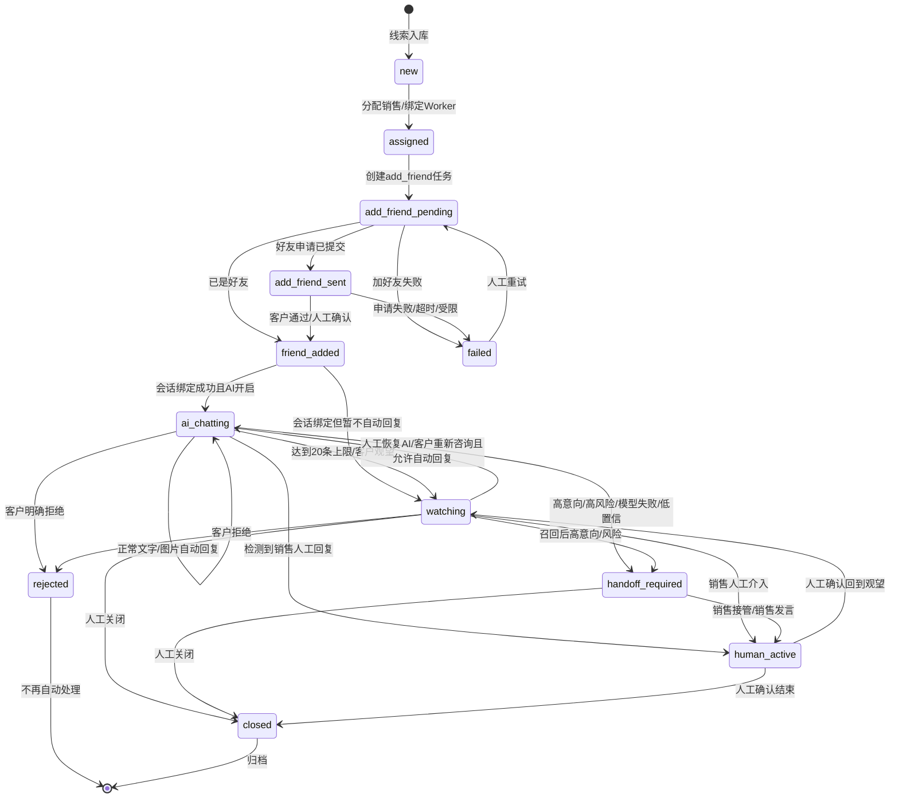
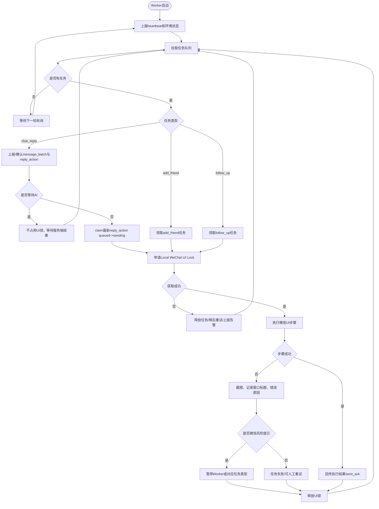
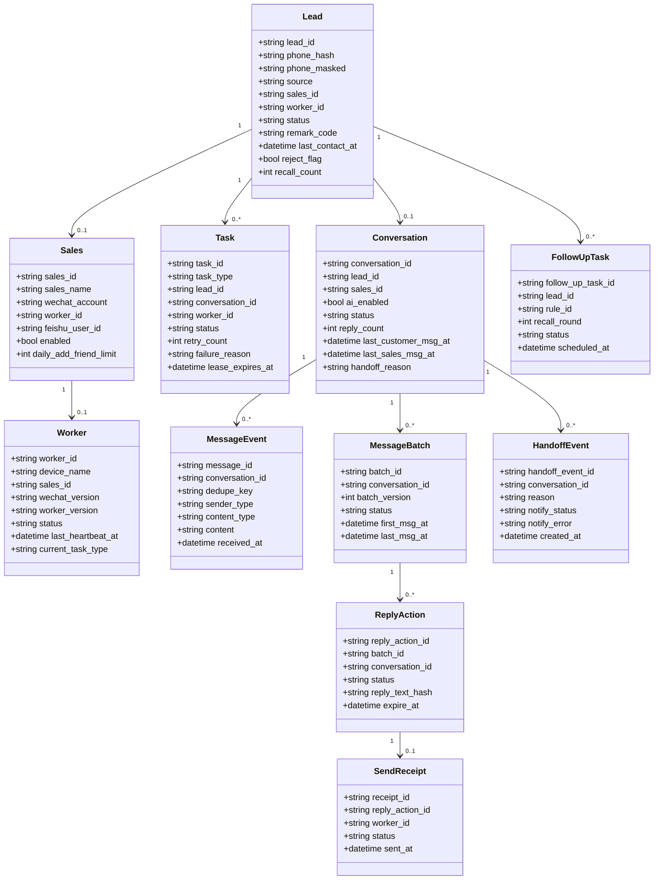
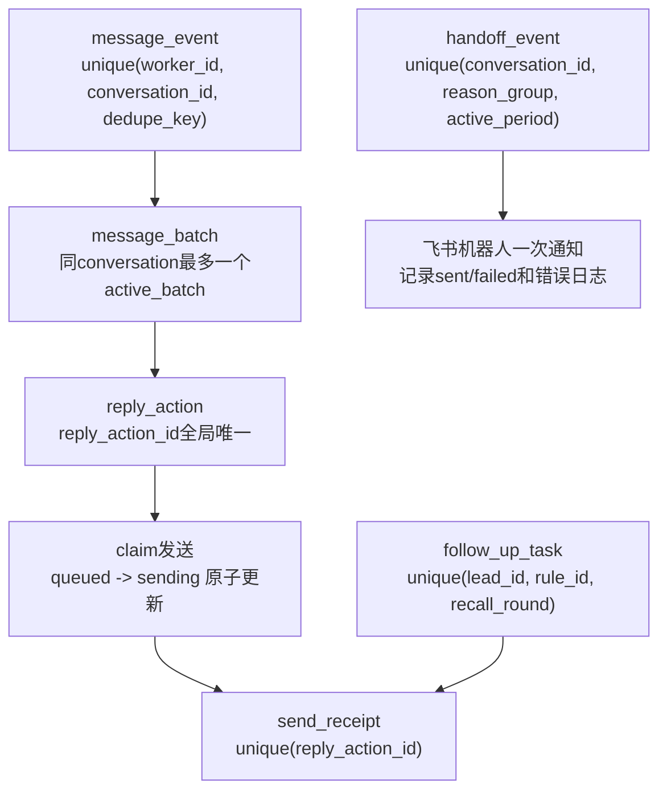

# AI智能客服售前跟进系统 UML图

版本：v1.0

日期：2026-05-26

口径：第一期正式工程版本。本文只描述一期工程范围，不包含二期 SaaS 化、多商户、复杂权限、计费体系。

## 1. 系统组件图

## 2. 主业务流程时序图

## 3. 多客户并发消息处理时序图

## 4. 会话主状态机图

## 5. Worker任务活动图

## 6. 核心数据类图

## 7. 关键幂等约束图

