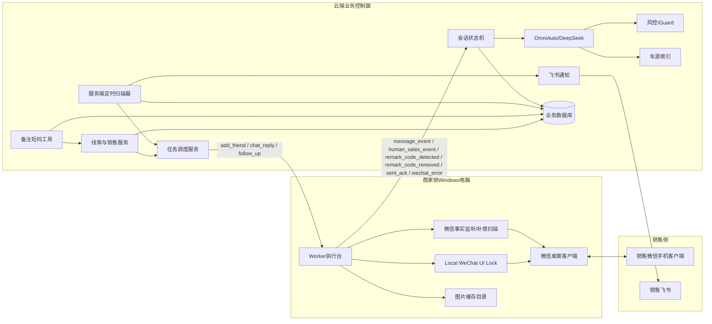
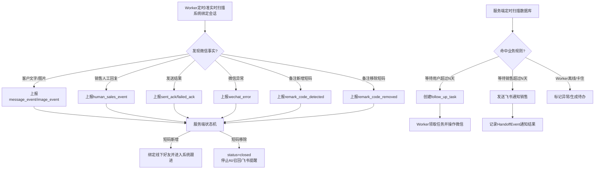
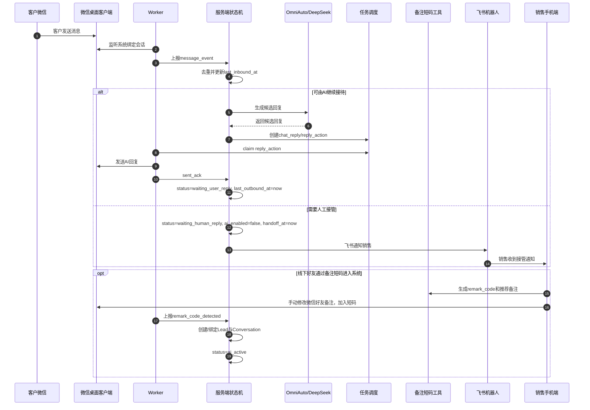
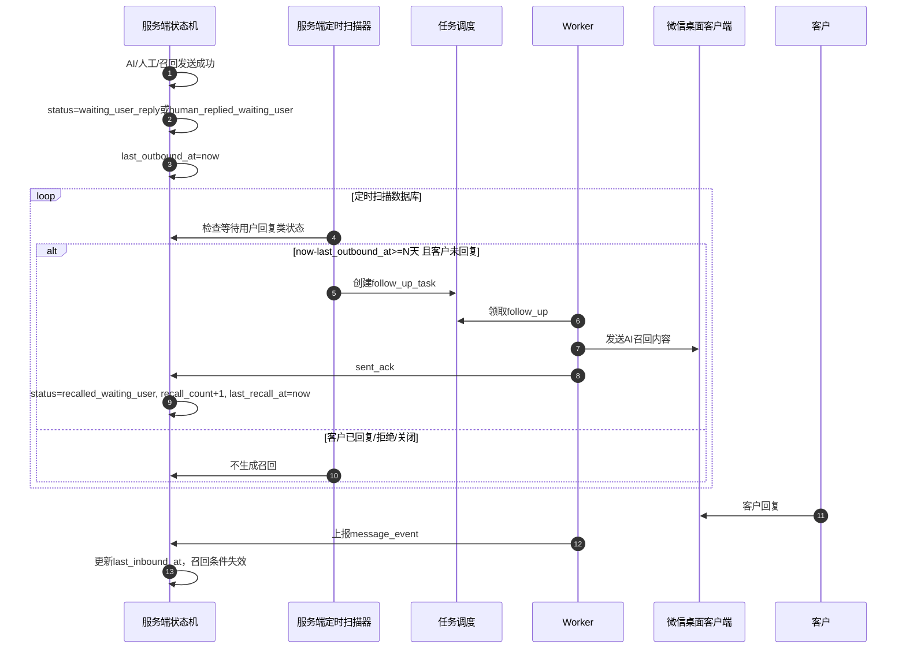
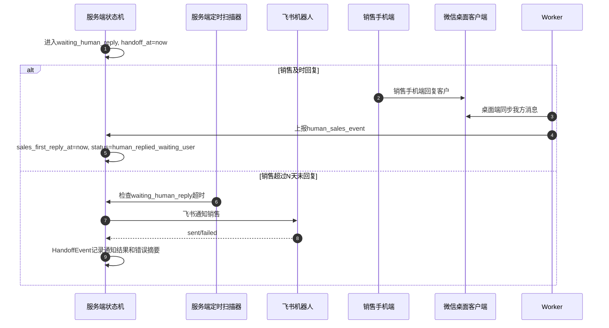
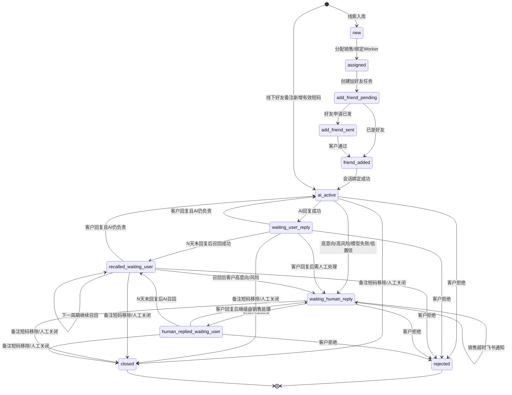
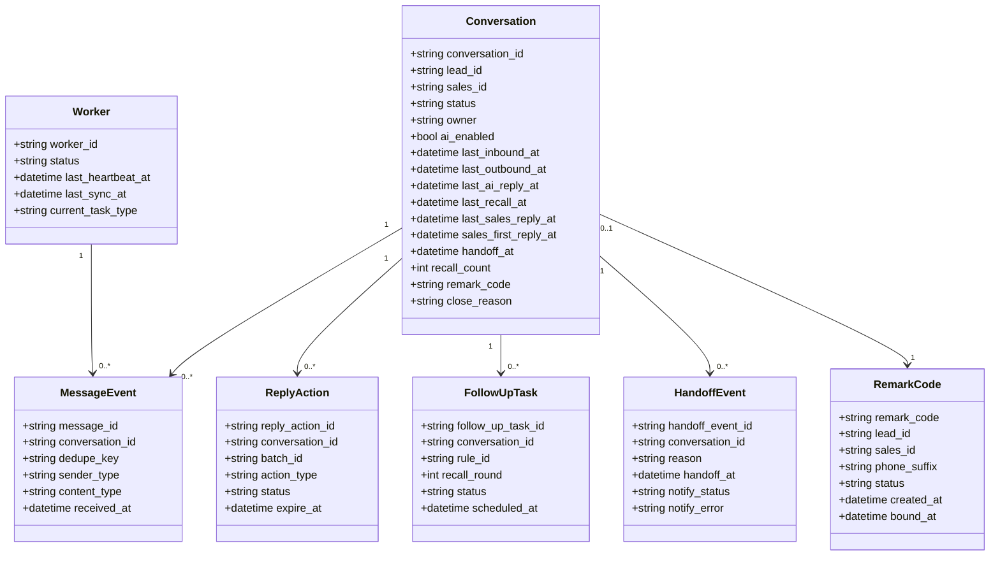
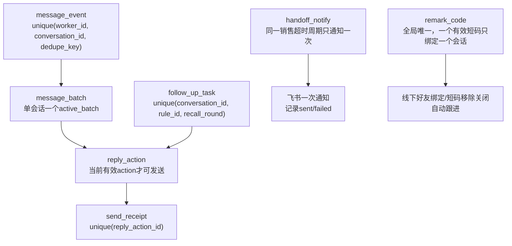

# AI智能客服售前跟进系统 UML图（状态机与备注短码重构版）

版本：v1.2

日期：2026-05-27

口径：第一期正式工程版本。取消 AI 固定轮次限制，采用长期跟进状态机；备注短码作为系统托管开关。

## 1. 职责边界组件图

## 2. Worker与服务端扫描分工图

## 3. 主业务时序图

## 4. 等待用户回复与多轮召回时序图

## 5. 转人工后销售超时提醒时序图

## 6. 会话状态机图

## 7. 核心数据类图

## 8. 幂等约束图

