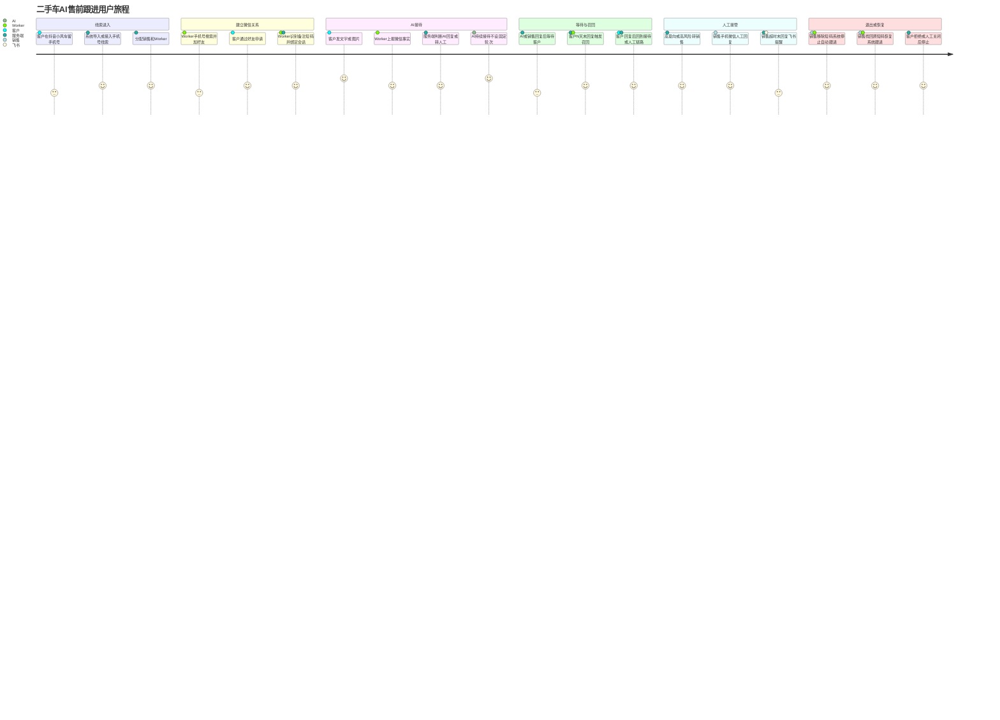
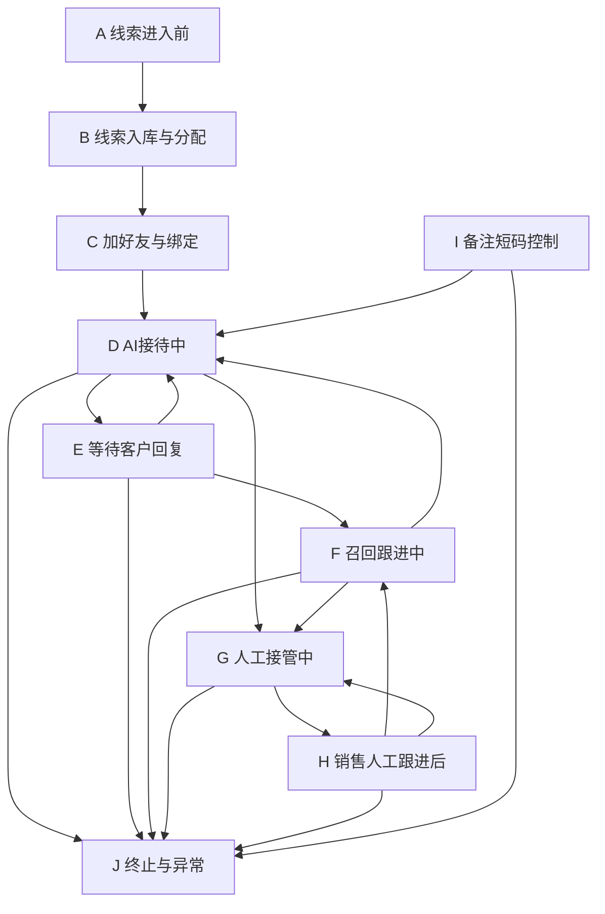

# AI智能客服售前跟进系统 用户旅程与场景覆盖矩阵（正式工程版）

版本：v2.5

日期：2026-05-27

适用范围：第一期正式工程版本。

目的：从真实销售场景出发，按 MECE 原则梳理客户、销售、Worker、服务端可能遇到的情况，检查当前技术方案如何处理，以及是否存在遗漏或需要补充的规则。

## 1. MECE拆分原则

为了避免场景重复或遗漏，本文按两个维度拆分：

```text
维度一：客户/销售当前处于哪个业务阶段
维度二：该阶段发生了哪一种互斥事件
```

主阶段互斥：

| 阶段 | 定义 |
|---|---|
| A. 线索进入前 | 客户还没有进入系统。 |
| B. 线索入库与分配 | 客户手机号已进入系统，但微信未绑定。 |
| C. 加好友与绑定 | 系统正在通过微信建立客户会话。 |
| D. AI接待中 | 客户由AI自动接待。 |
| E. 等待客户回复 | 我方已回复，等待客户下一步。 |
| F. 召回跟进中 | 客户长时间未回复，系统低频召回。 |
| G. 人工接管中 | AI停止，等待销售处理。 |
| H. 销售人工跟进后 | 销售已回复，等待客户。 |
| I. 备注短码控制 | 销售通过微信备注让系统进入或退出托管。 |
| J. 终止与异常 | 客户拒绝、系统关闭、绑定异常、微信异常等。 |

## 2. 总体用户旅程图



## 3. 主状态旅程图



## 4. 场景覆盖矩阵

### A. 线索进入前

| 编号 | 现实场景 | 当前方案处理 | 是否覆盖 | 备注/遗漏 |
|---|---|---|---|---|
| A1 | 客户来自抖音小风车手机号。 | 通过线索接入适配器进入系统。 | 已覆盖 | 接入方式可为Excel/CSV/API。 |
| A2 | 销售线下获得客户并自己加了微信。 | 使用备注短码工具生成短码，销售把微信备注改成包含短码，Worker识别后绑定。 | 已覆盖 | 这是新增关键入口。 |
| A3 | 客户主动加销售微信，但不在系统线索里。 | 销售可用短码工具补建线索并加备注短码。 | 已覆盖 | 前提是销售愿意录入或生成短码。 |
| A4 | 客户只打电话，不加微信。 | 当前系统不处理。 | 不覆盖 | 属于电话CRM/通话系统，不在本期范围。 |
| A5 | 客户来自其他渠道，如懂车帝、线下门店表单。 | 可走同一线索适配器或短码工具。 | 部分覆盖 | 若要自动接API需另做适配。 |

### B. 线索入库与分配

| 编号 | 现实场景 | 当前方案处理 | 是否覆盖 | 备注/遗漏 |
|---|---|---|---|---|
| B1 | 有效手机号首次入库。 | 创建Lead，分配销售/Worker，创建add_friend任务。 | 已覆盖 | 手机号默认脱敏。 |
| B2 | 重复手机号再次入库。 | 去重，不重复生成有效跟进线索。 | 已覆盖 | 需要保留来源记录。 |
| B3 | 已rejected客户再次入库。 | 不自动处理。 | 已覆盖 | 防止骚扰。 |
| B4 | 已closed客户再次入库。 | 当前需按业务确认是否重新打开。 | 待补充 | 建议默认不自动打开，需销售重新加短码或人工确认。 |
| B5 | 同一手机号被分给两个销售。 | 通过手机号/短码唯一约束避免多有效会话。 | 已覆盖 | 需要数据库唯一约束。 |
| B6 | 手机号无效。 | 标记失败原因，不生成有效加好友任务。 | 已覆盖 | 需手机号格式校验。 |

### C. 加好友与绑定

| 编号 | 现实场景 | 当前方案处理 | 是否覆盖 | 备注/遗漏 |
|---|---|---|---|---|
| C1 | Worker按手机号搜索并加好友。 | add_friend任务执行。 | 已覆盖 | 受微信限制影响。 |
| C2 | 客户已是好友。 | 不重复申请，直接尝试绑定。 | 已覆盖 | 依赖备注短码或会话识别。 |
| C3 | 客户未通过好友申请。 | 保持add_friend_sent或失败/待处理。 | 部分覆盖 | 是否超时后提醒/重试需配置。 |
| C4 | 微信提示操作频繁。 | Worker暂停相关任务并上报风险。 | 已覆盖 | 不承诺规避平台风控。 |
| C5 | 备注短码写入失败。 | 任务失败，记录原因。 | 已覆盖 | 无短码不应自动回复。 |
| C6 | 备注短码被销售移除。 | Worker上报remark_code_removed，服务端closed。 | 已覆盖 | 这是系统退出托管信号。 |
| C7 | 销售误删短码后又想恢复。 | 短码工具找回原短码，销售加回备注，Worker识别恢复。 | 已覆盖 | 不新建短码，避免历史断裂。 |
| C8 | 短码被加到错误客户备注上。 | 需要作废短码/人工处理。 | 待补充 | 建议加入“短码冲突/疑似错绑”异常状态或后台处理入口。 |

### D. AI接待中

| 编号 | 现实场景 | 当前方案处理 | 是否覆盖 | 备注/遗漏 |
|---|---|---|---|---|
| D1 | 客户持续正常咨询。 | AI持续接待，不设固定轮次上限。 | 已覆盖 | 受总开关、风控、静默、限频影响。 |
| D2 | 客户发图片。 | Worker另存，千问视觉识别，进入图文回复或转人工。 | 已覆盖 | 低置信转人工。 |
| D3 | 客户问价格、车况、金融、合同。 | Guard/关键词触发接管或安全回复。 | 已覆盖 | 具体词表待销售确认。 |
| D4 | 客户高意向，如想看车、问地址、问能否今天去。 | 转人工，进入waiting_sales_reply。 | 已覆盖 | 高意向标准需配置。 |
| D5 | 模型失败或超时。 | 不发兜底话术，转人工。 | 已覆盖 | 保守策略。 |
| D6 | 客户发语音、视频、文件、小程序卡片。 | 当前未明确支持。 | 遗漏 | 建议第一期遇到非文字/图片统一转人工，并记录unsupported_message_type。 |
| D7 | 客户连续发多条消息。 | 同会话合并batch，旧未发送reply_action作废。 | 已覆盖 | 防止答非所问。 |
| D8 | 多客户同时发消息。 | 按会话排队和UI锁执行。 | 已覆盖 | chat_reply优先级高于add_friend/follow_up。 |

### E. 等待客户回复

| 编号 | 现实场景 | 当前方案处理 | 是否覆盖 | 备注/遗漏 |
|---|---|---|---|---|
| E1 | AI回复后客户暂时不回。 | 状态waiting_user_reply。 | 已覆盖 | 服务端按last_outbound_at计算召回。 |
| E2 | 销售人工回复后客户暂时不回。 | 状态sales_replied_waiting_user。 | 已覆盖 | 到期也可召回。 |
| E3 | 召回后客户仍不回。 | 状态recalled_waiting_user，下一周期可继续召回。 | 已覆盖 | 次数、间隔、每日上限配置。 |
| E4 | 客户回复。 | Worker上报，召回条件失效。 | 已覆盖 | 未转人工则回AI；已转人工则销售继续。 |
| E5 | 客户明确拒绝。 | rejected，停止自动动作。 | 已覆盖 | 拒绝识别需保守。 |
| E6 | 等待期间销售移除短码。 | closed，停止自动跟进。 | 已覆盖 | 表示销售接手或不需要系统继续管。 |

### F. 召回跟进中

| 编号 | 现实场景 | 当前方案处理 | 是否覆盖 | 备注/遗漏 |
|---|---|---|---|---|
| F1 | 等待客户N天未回复。 | 服务端生成follow_up_task。 | 已覆盖 | N天可配置。 |
| F2 | 召回发送成功。 | 更新last_recall_at、recall_count、last_outbound_at，状态recalled_waiting_user。 | 已覆盖 | 由Worker sent_ack确认。 |
| F3 | 召回发送失败。 | 记录任务失败，不重复盲发。 | 已覆盖 | 是否人工处理需看失败原因。 |
| F4 | 召回命中静默时段。 | 延期或跳过。 | 已覆盖 | 需明确默认策略。 |
| F5 | 召回次数达到上限。 | 不再生成召回任务。 | 已覆盖 | 如果配置不限次数，仍受每日上限约束。 |
| F6 | 召回后客户高意向回复。 | 进入AI判断或直接转人工。 | 已覆盖 | 高意向优先转人工。 |

### G. 人工接管中

| 编号 | 现实场景 | 当前方案处理 | 是否覆盖 | 备注/遗漏 |
|---|---|---|---|---|
| G1 | AI判断需销售接管。 | waiting_sales_reply，飞书通知销售。 | 已覆盖 | AI停止自由回复。 |
| G2 | 销售及时回复客户。 | Worker识别sales_reply_event，进入sales_replied_waiting_user。 | 已覆盖 | 依赖桌面端同步。 |
| G3 | 销售N天没回复。 | 服务端飞书通知销售一次，记录sent/failed。 | 已覆盖 | 不做按钮、不做复杂通知。 |
| G4 | 转人工后客户继续发消息。 | AI不自由回复，继续由销售处理。 | 已覆盖 | 是否再次提醒销售当前不做。 |
| G5 | 销售线下电话联系但微信没回复。 | 系统无法知道，可能触发销售超时飞书。 | 部分覆盖 | 销售可移除短码关闭自动跟进，避免继续提醒。 |
| G6 | 销售接手后改备注。 | 短码移除即closed。 | 已覆盖 | 符合现实工作流。 |

### H. 销售人工跟进后

| 编号 | 现实场景 | 当前方案处理 | 是否覆盖 | 备注/遗漏 |
|---|---|---|---|---|
| H1 | 销售回复后客户不回。 | sales_replied_waiting_user，到期可召回。 | 已覆盖 | AI代销售低频跟进。 |
| H2 | 销售回复后客户继续问。 | 已转人工客户继续由销售处理。 | 已覆盖 | 不建议AI重新自由接管。 |
| H3 | 销售想让AI恢复接待。 | 找回/保留短码只能恢复系统托管，但是否AI接回需规则。 | 待补充 | 建议增加“人工链路恢复AI”配置：默认不自动恢复，需销售加特定短码或后台确认。 |
| H4 | 客户线下到店/成交/销售私聊推进。 | 销售移除短码，系统closed。 | 已覆盖 | 不需要额外销售工具。 |
| H5 | 销售误删短码。 | 找回原短码并加回备注，恢复原会话。 | 已覆盖 | 保留历史AI/人工记录。 |

### I. 备注短码控制

| 编号 | 现实场景 | 当前方案处理 | 是否覆盖 | 备注/遗漏 |
|---|---|---|---|---|
| I1 | 新线下客户要进入系统。 | 生成新短码。 | 已覆盖 | 生成后待Worker识别绑定。 |
| I2 | 老客户误删短码要恢复。 | 找回原短码。 | 已覆盖 | 不生成新短码。 |
| I3 | 老客户想重新AI接管。 | 找回原短码可恢复系统托管。 | 部分覆盖 | 是否从人工链路切回AI需单独规则。 |
| I4 | 短码绑定错人。 | 作废短码/人工处理。 | 待补充 | 需要异常处理入口。 |
| I5 | 一个微信备注里出现两个短码。 | 当前未定义。 | 遗漏 | 建议按异常处理，不自动绑定。 |
| I6 | 一个短码出现在两个微信好友备注里。 | 通过唯一性约束发现冲突。 | 部分覆盖 | 需要冲突告警和人工处理。 |

### J. 终止与异常

| 编号 | 现实场景 | 当前方案处理 | 是否覆盖 | 备注/遗漏 |
|---|---|---|---|---|
| J1 | 客户明确拒绝。 | rejected。 | 已覆盖 | 后续重复导入不自动处理。 |
| J2 | 销售移除短码。 | closed。 | 已覆盖 | 表示系统自动化退出。 |
| J3 | 人工后台关闭。 | closed。 | 已覆盖 | 作为兜底，不是主要销售动作。 |
| J4 | Worker离线。 | 服务端健康扫描标记异常。 | 已覆盖 | 会影响消息采集和发送。 |
| J5 | 微信登录失效。 | Worker上报wechat_error。 | 已覆盖 | 需要人工登录恢复。 |
| J6 | 图片另存失败。 | 转人工或记录失败。 | 已覆盖 | 低风险可提示人工处理。 |
| J7 | 服务端/Worker重启。 | 通过sent_ack、reply_action、unknown_send_result防重复。 | 已覆盖 | 核心验收项。 |
| J8 | 客户换微信号但手机号相同。 | 当前只能作为新会话处理或人工合并。 | 遗漏 | 一期可人工处理，后续再做客户合并。 |
| J9 | 多个微信UI任务同时到达。 | Worker本地排队，所有微信桌面端模拟人操作必须通过Local WeChat UI Lock串行执行。 | 已覆盖 | 非UI逻辑可并行，微信UI操作不可并行。 |
| J10 | 任何异常需要运维排障。 | 所有失败、暂停、跳过、异常恢复必须记录稳定错误码、解释说明、建议动作和trace_id。 | 已覆盖 | 控制面、Worker执行台、日志审计和验收问题单使用同一error_code。 |

## 5. 当前遗漏与建议补充

| 优先级 | 遗漏/风险 | 建议 |
|---|---|---|
| P0 | 非文字/图片消息类型未定义，如语音、视频、文件、位置、小程序。 | 第一版统一标记 `unsupported_message_type` 并转人工，不让AI硬回。 |
| P0 | 短码错绑、双短码、同短码出现在多个好友中未完全定义。 | 增加 `remark_code_conflict` 异常，暂停自动回复，人工处理。 |
| P0 | 异常只展示“未知错误”会导致运维无法定位。 | 建立统一错误码字典，所有异常必须包含 `error_code`、错误说明、建议动作和 `trace_id`。 |
| P1 | 已closed客户再次导入或重新出现短码时的恢复规则需更明确。 | 若原短码恢复则恢复原会话；若新导入则默认不自动打开，需销售确认。 |
| P1 | 人工链路中，销售想让AI重新接管的规则需要明确。 | 默认不自动切回AI；如果要支持，可通过“恢复AI托管”配置或特定短码规则实现。 |
| P1 | 销售线下电话处理但未移除短码，会触发销售超时提醒。 | 销售培训：线下接手后移除短码；系统记录close_reason。 |
| P2 | 客户换微信号、同手机号多微信、多手机号同客户。 | 一期人工处理，后续可做客户合并。 |

## 6. 结论

当前方案已经覆盖主业务闭环：

```text
抖音线索 -> 加好友 -> 绑定 -> AI持续接待 -> 等待用户 -> 多轮召回 -> 转人工 -> 销售超时提醒 -> 备注短码关闭/恢复
```

最需要补充的不是大流程，而是异常边界：

```text
非文字/图片消息统一转人工
短码冲突进入异常暂停
closed后的恢复规则写清楚
人工链路是否允许AI重新接管需要明确
```
